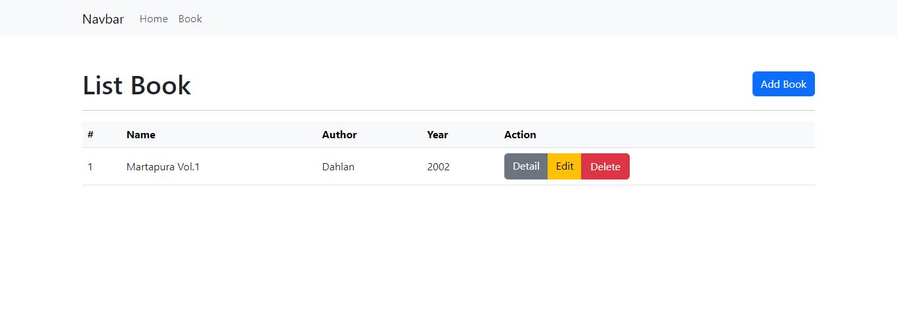

# CRUD-Laravel10# CRUD LIBRARY

👋 Hello, this is the CRUD Library project that I created.

## Description

This project is a CRUD (Create, Read, Update, Delete) application that is used to manage book data in a library. This application can help library staff to perform CRUD operations on book data easily and efficiently.

## Features

The following features are available in this application:

- Display a list of books and their details
- Adding new books to the database
- Editing existing book data
- Delete a book from the database

## Technology Used

- Laravel
- MySQL
- Javascript 
- Bootstrap

## Images

Here is a view of the CRUD Library application:

